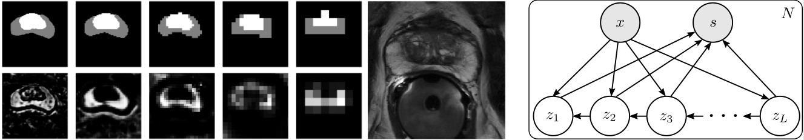

# PHiSeg Code

Public tensorflow implementation for our paper [PHiSeg: Capturing Uncertainty in 
Medical Image Segmentation](arxiv link) method, 
which was accepted for presentation at [MICCAI 2019](https://www.miccai2019.org/). 

If you find this code helpful in your research please cite the following paper:

```
@InProceedings{baumgartner2018visual,
TODO
}
```

## Method overview

Many medical image segmentation tasks are inherently ambiguous. For example, if six radiologists are asked
to segment two regions of the prostate in an MR image, you will get six different answers:


We address this problem by developing a hierarchical probabilistic model that - unlike
most conventional segmentation techniques - does not produce a single segmentation, 
but rather produces **samples from the distribution of probable segmentations for a specific image**.

Here is an example of our methods output for the same test image. 


It can be seen that the samples are very similar to those generated by the 6 experts above. 

Having access to such samples allows us to give a human user of this tool several options to choose from. 
The model can also be used to determine the most likely sample according to our model, and to **visualize 
areas of high uncertainty**. 

The method functions by constructing a hierarchical probabilistic model that generates assumes 
a generative process for the segmentation s, given the image x, in which the image is constructed
one resolution level at a time (similar to Laplacian pyramids). The generation of each resolution 
level is assumed to be governed by a hidden, low dimensional variable z_l. Here is an image of the graphical model (right)
along with and example of the generative process (left).



In our [paper](arxiv link), we show that inference in this probabilistic model can be performed
using a variation of the well known autoencoding variational Bayes framework. 

In the paper, we show that we outperform the related probabilistic U-NET on two relevant metrics. We furthermore
show that **taking the probabilistic perspective for the segmentation problem comes at no cost for
segmentation accuracy!** Our method performs just as well (in fact slightly better) than a deterministic
U-NET on the conventional Dice Score metric. 


## Running the code

The code is implemented in Python 3.5 using using the tensorflow library. We only tested the code
with tensorflow 1.12. In order to run the code, follow the following steps:

 * Set up a virtual environment (e.g. conda or virtualenv) with Python 3.5
 * Install all non-tensorflow requirements using:
  
  ````pip install -r requirements.txt````
  
 * Install the GPU version of tensorflow using
 
 ````pip install -r tensorflow-gpu==1.12````

 * Open `config/system.py` and change the settings to match your system.

 * Start training a model by running `python phiseg_train`
 
 * The easiest way to monitor training is using tensorboard
 
 * After training has finished, you can using `phiseg_generate_samples.py` to sample from 
 the learned distribution, and `phiseg_test_quantitative` to obtain the quantitative results
 reported in the paper. 

## Data

The public implementation of our code currently trains and evaluates on the publicly available
[LIDC Chest Lesion dataset](https://wiki.cancerimagingarchive.net/display/Public/LIDC-IDRI). We used the 
 preprocessed data available on [Stefan Knegt's gihub page](https://github.com/stefanknegt/Probabilistic-Unet-Pytorch) 
 (see link at the very bottom). 
 
The prostate dataset collected at University Hospital Zurich is unfortuantely not publicly available
as of yet. 

## Code structure

Under `phiseg/experiments` you will find a number of experiment config files, where the
architecture and training details of the method are specified. Modify these files to explore different settings. 